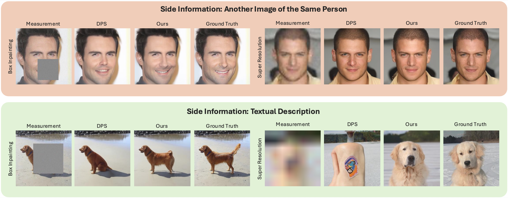

# 🛠️ DISS: Inference-Time Search using Side Information for Diffusion-based Image Reconstruction

## Introduction
<ins>**D**</ins>iffusion-based <ins>**I**</ins>nference-time <ins>**S**</ins>earch using <ins>**S**</ins>ide Information for solving inverse problems is a modular framework for improving image reconstruction using pretrained diffusion models.
**DISS** enables the use of arbitrary side information, such as identity embeddings, text prompts **inference time** without retraining. It performs particle-based search guided by reward functions that evaluate alignment with the side information, improving perceptual and semantic quality of reconstructions.

<p align="center">
  
</p>

## Getting Started
### 1) Clone the repository
```bash
git clone https://github.com/mahdi124710/DISS.git
cd DISS
````

### 2) Set up environment
```bash
conda create -n DISS python=3.8
conda activate DISS
pip install -r requirements.txt
conda install pytorch==2.3.0 torchvision==0.18.0 torchaudio==2.3.0 pytorch-cuda=12.1 -c pytorch -c nvidia
````
<br />

### 3) Set up DPS
```bash
# clone repositories
git clone https://github.com/DPS2022/diffusion-posterior-sampling.git integrations/dps/diffusion-posterior-sampling
git clone https://github.com/VinAIResearch/blur-kernel-space-exploring integrations/dps/diffusion-posterior-sampling/bkse
git clone https://github.com/LeviBorodenko/motionblur integrations/dps/diffusion-posterior-sampling/motionblur

# download pretrained models
mkdir integrations/dps/diffusion-posterior-sampling/models
gdown 1BGwhRWUoguF-D8wlZ65tf227gp3cDUDh -O integrations/dps/diffusion-posterior-sampling/models/ffhq_10m.pt
gdown 1HAy7P19PckQLczVNXmVF-e_CRxq098uW -O integrations/dps/diffusion-posterior-sampling/models/imagenet256.pt
gdown 1vRoDpIsrTRYZKsOMPNbPcMtFDpCT6Foy -O integrations/dps/diffusion-posterior-sampling/bkse/experiments/pretrained/GOPRO_wVAE.pth

# apply minimal modifications to DPS to call our reward and search modules
git -C integrations/dps/diffusion-posterior-sampling apply ../dps_modifications.patch
python integrations/add_inits.py
````
<br />

### 4) Set up AdaFace reward
```bash
mkdir third_party
git clone https://github.com/mk-minchul/AdaFace.git third_party/AdaFace
mkdir third_party/AdaFace/pretrained
gdown '1g1qdg7_HSzkue7_VrW64fnWuHl0YL2C2' -O third_party/AdaFace/pretrained/adaface_ir50_ms1mv2.ckpt
````
<br />


### 5) Blind-DPS Setup

```bash
# clone repositories
git clone https://github.com/BlindDPS/blind-dps.git integrations/blinddps/blind-dps
git clone https://github.com/LeviBorodenko/motionblur integrations/blinddps/blind-dps/motionblur

# download pretrained models
mkdir integrations/blinddps/blind-dps/models
gdown 1nAhgjU8C6DCkOLmWTuPIzA6PMNkNmE5Z -O integrations/blinddps/blind-dps/models/ffhq_10m.pt
gdown 11Xn8tsisCCIrv3aFyitmj55Sc13Wwb8j -O integrations/blinddps/blind-dps/models/kernel_checkpoint.pt

# apply minimal modifications to BlindDPS to call our reward and search modules
git -C integrations/blinddps/blind-dps/ apply ../blind_dps_modifications.patch
python integrations/add_inits.py
````

<br />

### 6) DAPS Setup

Clone the required repositories and download pre-trained models:

```bash
# clone repositories
git clone https://github.com/zhangbingliang2019/DAPS.git integrations/daps/DAPS

# download pretrained models
mkdir integrations/daps/DAPS/checkpoints
gdown 1BGwhRWUoguF-D8wlZ65tf227gp3cDUDh -O integrations/daps/DAPS/checkpoints/ffhq256.pt

# apply minimal modifications to DAPS to call our reward and search modules
git -C integrations/daps/DAPS apply ../daps_modifications.patch
python integrations/add_inits.py
````

